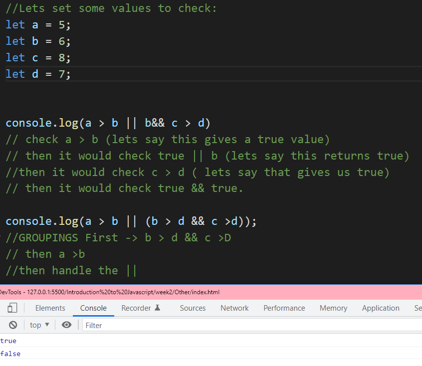

# All About Booleans 

## Boolean Question
### print the result of a is greater than b or b and c are greater than d.

Print the result of  **a is greater than b**  or  _b and c are greater than d_

1.	Highlight two statements. 
2.	Statement one(bold) Asks if a is greater than b. a > b
3.	Statement two (italic) Wants to see if b and c are greater than d. So is b > d and c > d. 
4.	Those two statements are or’d. a >b || ( b > d && c > d)

There is a difference between <ins>a > b || b&& c > d</ins> vs <ins>(a > b || (b > d && c >d));</ins>

The first statement would execute (a > b || b) && (c >d) due to [order precedence.](https://developer.mozilla.org/en-US/docs/Web/JavaScript/Reference/Operators/Operator_Precedence)

The second statement would execute evaluate the parenthesis (b > d && c > d), then handle the or with a > b || (whatever value the && statement returned)

They may have the same answer usually, but there is a case where they have different answers. If b < c but c > d

